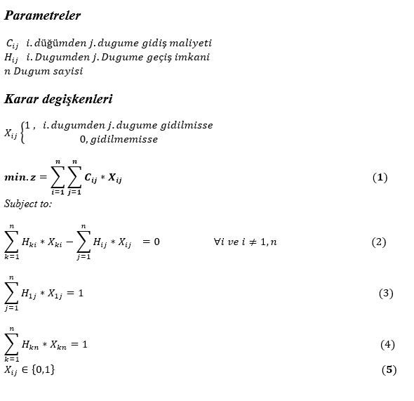

# Shortest Path Problem – Conceptual Overview

This project focuses on finding the **minimum‐cost path from node 1 to node n** on a directed/undirected, weighted graph. Run instructions and model code explanations live in the repo; this document only provides the conceptual framework.

---

## Problem Definition

- **Input:**
  - Node set \( N=\{1,\dots,n\} \)
  - Arc/edge set \( A \subseteq N \times N \)
  - **Cost/weight** for each arc \( c_{ij} \ge 0 \) (typically)
  - (Optional) **Relation/permission matrix** \( R_{ij} \in \{0,1\} \) — \( R_{ij}=1 \) means the move \( i \to j \) is allowed
- **Output:**
  - A **feasible** path from source \( s=1 \) to target \( t=n \) with **minimum total cost** (a sequence of nodes/arcs)

---

## Notation

- \( N \): nodes, \(|N|=n\)  
- \( A \): allowed arcs (in practice determined via \( R \))  
- \( c_{ij} \): cost of arc \( i \to j \)  
- \( s=1 \): source, \( t=n \): sink

---

## Typical Assumptions

- **Weights:** In most applications \( c_{ij} \ge 0 \). If negative weights exist, algorithm/model choices change.  
- **Connectivity:** At least one allowed path from \( s \) to \( t \) exists (otherwise the problem is infeasible).  
- **Directionality:** The graph may be **directed**; then \( c_{ij} \) and \( c_{ji} \) are independent.

---

## Path Feasibility

- The path starts at \( s \) and ends at \( t \).  
- For intermediate nodes, **flow conservation** holds: number of entering arcs equals number of leaving arcs (in a 0/1 decision-variable formulation).  
- Self-loops (\( i \to i \)) are not used.  
- In a basic shortest path setting, **subtours** are not expected; if additional constraints/objectives are present, subtour elimination may be needed.

---

## Modeling with the Relation Matrix \( R \)

- Set \( R_{ij}=0 \) to **forbid** an arc (shrinks the search space and speeds up solving).  
- \( R_{ij}=1 \) means the arc is allowed; prefer using \( R \) instead of very large “\( M \)” costs to effectively forbid arcs.

---

## Algorithmic Perspective (Reference)

- **Nonnegative weights:** Dijkstra  
- **Negative weights present:** Bellman–Ford  
- **Unweighted (0/1):** BFS or 0–1 BFS  
- **DAG:** Single pass via topological order

> This repository solves the problem via an **optimization (MIP/OPL)** model; algorithms are listed for reference.

---

## Applications

- Route planning, network traffic, supply chains, production lines, communication networks, subproblems in scheduling.

---

## Data Expectations

- `c[i][j]`: cost matrix (Excel/CSV/OPL `.dat`)  
- `R[i][j]`: permission matrix (0/1)  
- Nodes are indexed from 1 to \( n \); source is 1, target is \( n \)

---

## Edge Cases & Tips

- **Unreachable target:** Model becomes infeasible → check data/`R`.  
- **Multiple optimal paths:** Total cost can tie; any optimal path is acceptable.  
- **Large graphs:** Prune with `R`, use time/gap limits and cutting planes to improve performance.

---

## Mathematical Model 

Add your own formulation under the headings below.

### Objective Function
## Mathematical Model

---

## Notes on the Mathematical Model

- **Equation (1) — Objective Function:**  
  Minimizes the total cost to reach the target node, i.e., it seeks the lowest-cost path from the source to the destination.

- **Equation (2) — Flow Conservation at Intermediate Nodes:**  
  Ensures that, for every intermediate node, the number (or amount) of incoming arcs equals the number (or amount) of outgoing arcs, preserving feasibility of the path.

- **Equation (3) — Source Specification:**  
  Guarantees that the path starts at the designated source node, which in this setting is node \(1\).

- **Equation (4) — Sink Reachability:**  
  Ensures that the path reaches the designated terminal node (the sink), i.e., the final destination of the route.

> This mathematical model was formulated and implemented in **IBM ILOG CPLEX (OPL)**.

## How to run
- Open the project in **IBM ILOG CPLEX Studio**.
- Open the SPP2 folder.
- Run "run configration"
- View the results in the output console.
- Modify the data files as needed to test different scenarios.

---

**Author:** Ali Emre / OptimalRoute.org  
**Date:** November 2, 2025
